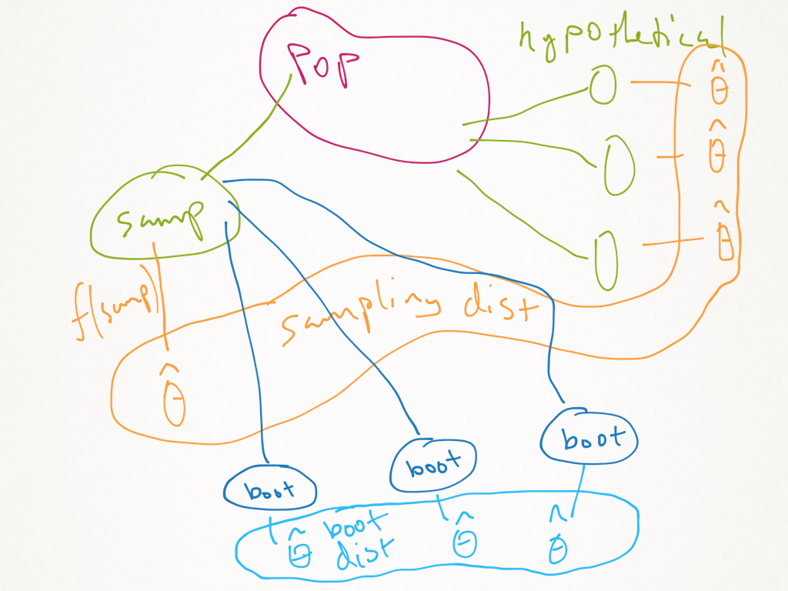

\newcommand{\Expect}[1]{\mathbb{E}\left[ #1 \right]}
\newcommand{\Var}[1]{\mathbb{V}\left[ #1 \right]}
\newcommand{\Cov}[2]{\mathrm{Cov}\left[#1,\ #2\right]}
\newcommand{\given}{\ \vert\ }
\newcommand{\E}{\mathbb{E}}
\renewcommand{\P}{\mathbb{P}}
\newcommand{\R}{\mathbb{R}}

## HW reminders

1. No code in the `pdf`. 
  
2. If you put plots or tables in, you must talk about them. 
  
  > Rule of thumb: if you don't have anything good to say about a number, don't give the number (or plot) at all.
  
3. __MOST IMPORTANT__ you must explain your results. Simply providing them is not likely to get you credit.

4. Look over the model solutions for the last assignments. 

## Project progress report

* Due __2 March at 11:59 pm__ ( just over 1 week from today)

* Your report should have 3 components:  

    1. A list of teammate names and an explanation of what is interesting to you about this data.
    2. A short introductory paragraph introducing the data and describing some potential questions you might investigate.
    3. A lengthy exploratory data analysis.
    
* The third part is a big deal.

* You need to provide evidence that you have explored the data carefully and meaningfully.

* Code must be integrated.

* Think of this like HW 2.

* Just like with HW 2 and HW 3, much of what you do on the midterm will end up in the final report, so spend the time to do a good job.

## Multiple datafiles

* The data come in one big file.

* This is not like data you have been working with before.

* I haven't cleaned it and made it easy to work with.

* You have to clean it and make it easy to work with.

## Structure of the files

* Typically, you get data that looks like this:

```{r, echo=FALSE}
signif(data.frame(y=rnorm(5), x1=rnorm(5), x2=rnorm(5)),3)
```

* This time, your data looks like this:

```{r}
load('../project/processedAttendance.Rdata')
head(attend)
```


## Structure of the files

* You need to decide what the "unit of observation" is.
    * Maybe it is an individual visit, then this data frame is "ok"
    * Maybe it is a class, then there are multiple records per class, how do you combine them?
    * Maybe it is a type of class, then there many records. Again how do you combine?
    
* __YOU__ need to really think about this. You may (will, can, should) use all three to do some analyses.


## Why Simulation?

* Up until now, when we do linear models, we used $t$-statistics, $p$-values, CIs

* These things are based on the sampling distribution of the estimators ($\hat{\beta}$) if the model is true and we don't do any model selection.

* What if we do model selection, use Kernels, think the model is wrong?

* None of those formulas work. And analogous formulas can be __impossible__ (or painfully annoying) to derive.


## Some simulation basics

```{r}
set.seed(2017-02-21)
sample(1:10, replace=TRUE, prob=1:10/10)
sample(letters[1:10], replace=TRUE, prob=1:10/10)
sample(letters[1:10], replace=TRUE)
sample(letters[1:10])
```

## Resampling data

```{r, fig.align='center', fig.height=5}
set.seed(2017-02-21)
n = 100; x = runif(n)
df = data.frame(x=x, y=3+2*x+rnorm(n))
plot(df, las=1, bty='n',pch=19, col=4)
```


## A sample (with replacement), and a new draw from the same distribution

```{r, fig.align='center', fig.height=5}
plot(df, las=1, bty='n',pch=19, col=4)
df2 = df[sample(1:n, replace=TRUE),]
xn = runif(n)
df3 = data.frame(x=xn, y=3+2*xn+rnorm(n))
points(df2, col=2, pch='+', cex=1.5)
points(df3, col=3, pch=19)
```

## Add some lines

```{r, fig.align='center', fig.height=5}
plot(df, las=1, bty='n',pch=19, col=4)
points(df2, col=2, pch='+', cex=1.5)
points(df3, col=3, pch=19)
abline(lm(y~x, data=df), col=4, lwd=2)
abline(lm(y~x, data=df2), col=2, lwd=2)
abline(lm(y~x, data=df3), col=3, lwd=2)
```

## Using simulations to check modelling assumptions

```{r, fig.align='center', fig.height=5}
x = runif(n) - 0.5; y = 3+2*x + rnorm(n)*x^2
dfHetero = data.frame(x=x, y=y)
plot(dfHetero, las=1, bty='n', pch=19, col=4)
abline(lm(y~x, data=dfHetero), col=4, lwd=2)
abline(a=3, b=2, col=2)
```

## If the noise is homoskedastic...

* The red and blue points should have the same distribution

```{r, fig.align='center', fig.height=5}
heteroMod = lm(y~x, data=dfHetero)
plot(dfHetero$x, residuals(heteroMod), las=1, bty='n', pch=19, col=4)
abline(h=0, col=4, lwd=2)
points(dfHetero$x, residuals(heteroMod)[sample(1:n, replace=TRUE)], col=2, pch=19)
```

## That one was easy

```{r, fig.align='center', fig.height=5}
x = runif(n)-0.5
y = 3+2*x + c(arima.sim(list(ar=.8), n, rand.gen = function(n) 0.1* rt(n, df=5)))
dfTS = data.frame(x=x, y=y)
plot(dfTS, las=1, bty='n', pch=19, col=4)
abline(lm(y~x, data=dfTS), col=4, lwd=2)
abline(a=3, b=2, col=2)
```

## If the noise is homoskedastic...

* The red and blue points should have the same distribution

```{r, fig.align='center', fig.height=5}
tsMod = lm(y~x, data=dfTS)
resids = residuals(tsMod)
plot(dfTS$x, resids, las=1, bty='n', pch=19, col=4)
abline(h=0, col=4, lwd=2)
points(dfTS$x, resids[sample(1:n, replace=TRUE)], col=2, pch=19)
```

## But...

```{r, fig.align='center', fig.height=5}
lag.resids = data.frame(lag.resids = resids[-n], resids = resids[-1])
plot(lag.resids, las=1, bty='n', pch=19, col=4)
resamp.lag.resids = data.frame(lag.resids=resids[-n], 
                      resids=resids[sample.int(nrow(lag.resids), replace=TRUE)])
points(resamp.lag.resids, col=2, pch=19)
abline(lm(resids~lag.resids, data=lag.resids), col=4)
abline(lm(resids~lag.resids, data=resamp.lag.resids), col=2)
```


## Another useful command

```{r}
sample.int(10)
```

## What's the deal with this Bootstrap?

<center></center>

## What's the deal with this Bootstrap?

* Suppose I want to estimate something and get a CI.

* But I don't know how to calculate the CI (or maybe I do, but it's hard)

* Then what?

## Example 1

* Let $X_i\sim \chi_4^2$.

* I know if I estimate the mean with $\bar{X}$, then by the CLT (if $n$ is big), 
\[
\frac{\sqrt{n}(\bar{X}-\Expect{X})}{s} \approx N(0, 1).
\]

* This gives me a 95% confidence interval like
\[
\bar{X} \pm 2*s/\sqrt{n}
\]

* But I don't want to estimate the mean, I want to estimate the median.

```{r, fig.align='center', fig.height=4}
par(mar=c(2,3,0,0))
curve(dchisq(x, df=4), from=0, to=12, bty='n', las=1, col=2,ylab='')
abline(v=4, col=4) # mean
abline(v=qchisq(.5, 4), col=2) # median
```

## Now what

```{r, echo=FALSE}
n = 50
```

* I give you a sample of size `r n`, you give me the sample median.

* How do you get a CI?

* You can use the bootstrap!

```{r, fig.align='center', fig.height=4}
set.seed(2017-02-18)
x = rchisq(n, 4)
(med = median(x))
B = 100
alpha = 0.05
bootMed <- function(x) median(sample(x, length(x), replace=TRUE))
bootDist = replicate(B, bootMed(x))
bootCI = 2* med - quantile(bootDist, probs = c(1-alpha/2, alpha/2))
plot(density(bootDist), bty='n', las=1, main='')
abline(v=bootCI, col=1, lty=3)
abline(v=med, col=4)
abline(v=qchisq(.5, 4), col=2)
```

## An alternative

* In that bootstrap, I didn't use any information about the data-generating process.

* What if I told you that the data came from a $\chi^2$, but I didn't tell you the degrees of freedom?

* You could try a "parametric" bootstrap:

```{r, fig.align='center', fig.height=4}
xbar = mean(x)
s = sd(x)
ParaBootSamp <- function(B, xbar, s){
  means = rnorm(B, mean=xbar, sd=s/sqrt(n))
  meds = qchisq(.5, means)
  return(meds)
}
ParaBootDist = ParaBootSamp(B, xbar, s)
ParaBootCI = 2* med - quantile(ParaBootDist, probs = c(1-alpha/2, alpha/2))
plot(density(ParaBootDist), bty='n', las=1, main='')
abline(v=ParaBootCI, col=1, lty=3)
abline(v=med, col=4)
abline(v=qchisq(.5, 4), col=2)
```

## In truth

* Let's compare these intervals

* The nonparametric bootstrap (first one) had a width of
```{r}
bootCI[2] - bootCI[1]
```

* The parametric bootstrap (second one) had a width of
```{r}
ParaBootCI[2] - ParaBootCI[1]
```

* Using theory, we could find the exact CI. In this case, it has a width of 1.76.


## Bootstrap diagram

<center></center>

## Bootstrap intuition

<center></center>

## Bootstrap error sources

(From the bottom up on the last slide)

1. Simulation error: using only $B$ samples to estimate $F$ with $\hat{F}$.

2. Statistical error: our data depended on a sample from the population. We don't have the whole population so we make an error by using a sample (Note: this part is what __always__ happens with data, and what the science of statistics analyzes.)

3. Specification error: If we use the model based bootstrap, and our model is wrong, then we think we are badly overconfident in our assessment of error. 

## Recap

* There are essentially 2 types of bootstrap
    1. Parametric
    2. Nonparametric
    
* If you __really__ believe your model, use the first

* If not, use the second

* Both are valid

## Example 2

```{r, echo=FALSE}
library(MASS)
fatcats = cats
fatcats$Hwt = fitted(lm(Hwt~Bwt, data=cats)) + rt(nrow(fatcats), 3)
```

```{r, fig.width=8, fig.height=6, fig.align='center'}
library(MASS)
plot(Hwt~Bwt, data=fatcats, pch=19, col=4, las=1)
```

## A model

```{r}
cats.lm <- lm(Hwt ~ 0+Bwt,data=fatcats)
summary(cats.lm)
confint(cats.lm)
```

## I think that that CI is wrong...

```{r, fig.align='center', fig.width=7, fig.height=5}
qqnorm(residuals(cats.lm))
qqline(residuals(cats.lm))
```

## Model-based bootstrap

```{r}
catsResids <- function(){
  resids = residuals(cats.lm)
  newResids = sample(resids, length(resids), 
    replace=TRUE) # resample the residuals from the original model
  newCats = data.frame(Bwt = fatcats$Bwt, 
    Hwt=fitted(cats.lm) + newResids) # create a new dataframe 
                                     # with the original x's but new y's
  return(newCats)
}
fitCats <- function(newCats) coef(lm(Hwt~0+Bwt, data=newCats)) # get the coef from OLS
fitCats(fatcats) # test the above on original data, should give same coef
```


## Model-based bootstrap

```{r, cache=TRUE, autodep=TRUE}
catsBoot <- function(B, alpha, func, bootname){
  coefs = replicate(B, fitCats(func())) # the bootstrap distribution hat(F)
  ci = 2*coef(cats.lm) - quantile(coefs, probs = c(1-alpha/2, alpha/2)) # ci
  cis = rbind(confint(cats.lm), ci) # The rest just for comparison
  rownames(cis) = c('original',bootname)
  return(cis)
}
cisPara = catsBoot(1000,.05, catsResids, 'MBB') # do it!
```

## Nonparametric bootstrap

```{r,cache=TRUE, autodep=TRUE}
resampData <- function(){
  sampled.rows = sample(1:nrow(fatcats), size=nrow(fatcats),
    replace=TRUE) # resample original data
  new.cats = fatcats[sampled.rows,]
}
cisNonPara = catsBoot(1000, .05, 
              resampData, 'NonParaB') # use the prev func to 
                                     # bootstrap on resampled data
cisPara
cisNonPara
```

## Bootstrapping with nonparametric regression

* This is a bit harder

* The reason is that we use CV to choose the bandwidth

* So we have to repeat that step in the bootstrapping

* That is:  

    1. Input data
    1. Use CV to choose a smoothing parameter
    2. Use the chosen parameter to estimate the smooth function
    3. Resample the data
    4. Using this new data, repeat 2 and 3