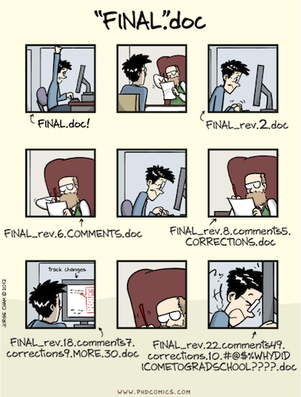

## Acknowledgements

* Much of this lecture is borrowed/stolen from Colin Rundel and Karl Broman


## Why version control?



## Why version control?

* Simple formal system for tracking all changes to a project
* Time machine for your projects
    + Track blame and/or praise
    + Remove the fear of breaking things
* Learning curve is steep, but when you need it you REALLY need it

> Your closest collaborator is you six months ago, but you don’t reply to emails.
> -- _Paul Wilson_

## Why Git

* You could use something like Box or Dropbox
* These are poor-man's version control
* Git is much more appropriate
* It works with large groups
* It's very fast
* It's much better at fixing mistakes
* Tech companies use it (so it's in your interest to have some experience)

> This will hurt, but what doesn't kill you, makes you stronger.

## Set up

* Open Rstudio
* Go to the "Tools" menu and select "Shell"
* Type 

```
git --version
```

* If it's there, you're done, otherwise...


## Initial configuration

* Now tell it who your are:

```
$ git config --global user.name "Daniel McDonald"
$ git config --global user.email "dajmcdon@gmail.com"
$ git config --global core.editor nano
```

* `nano` is a light-weight text editor. You probably won't ever use it, but it's good to tell
git to use nano. If for some reason git asks you questions about doing things, just remember

> Ctrl + X is quit

(it says this at the bottom of the window)

* This is all that we will do with git in the terminal
* Rstudio has git built in, and so we'll use it through there mostly
* Using the terminal gives access to more complicated issues, which hopefully we won't have to deal with.

## Github

* This is a commercial site that interacts with Git (GitLab and Bitbucket do as well)
* You need a free account http://www.github.com/
* Git tracks changes to your files in both places
* Your files live in __repositories__ (repos in the lingo)
* You and others share access to repos

## When you want to work on a file

* You __pull__ the repo onto your local machine
* Make all your changes
* You __commit__ your changes with a message, e.g.: "I fixed the horrible bug"
* You __push__ your changes back to the repo

## The hard way 

* You will do this practice, this once, using the terminal or a GUI 
* I use [GitKraken](http://www.gitkraken.com/), but see the reading assignment, below
* If stuff gets messed up later, we can clean it up with the GUI
* It's a little easier than in Rstudio to fix things

## The rest

* All the rest of the time, we'll just use Rstudio
* You clone a repo using Rstudio, make your changes, and push using Rstudio

## Slack

* We will use another service called [Slack](http://www.slack.com/) for communication
* It is also free
* It is also common in industry
* It's just a way to send me, the TA, or your classmates messages
* This replaces the discussion board, announcements, etc on Canvas
* This way, you can talk to your team, you can talk to me, you can ask the class questions
* There are Android and iOS apps
* I use it in my web browser, so I will not always be there.

## HW0

* Go to https://github.com/STATS-432Sp2017/HW0
* By noon tomorrow, complete steps 1 and 2
* Read http://happygitwithr.com/index.html
* Bring your laptop on Thursday (see me if you need an alternate solution)